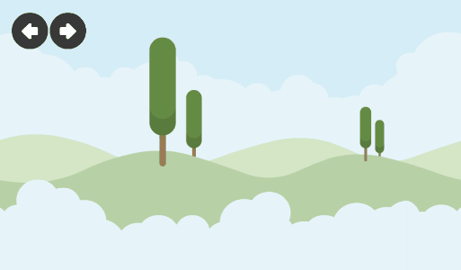
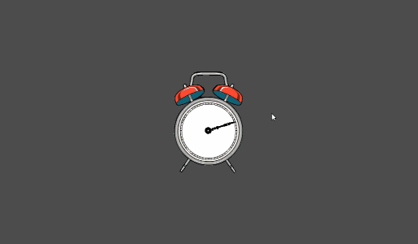
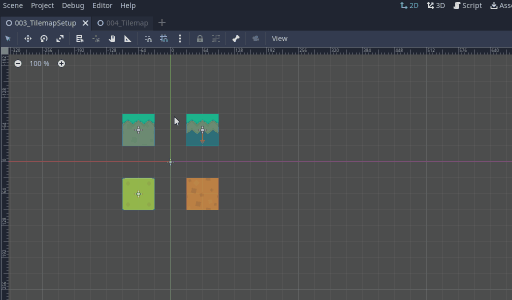
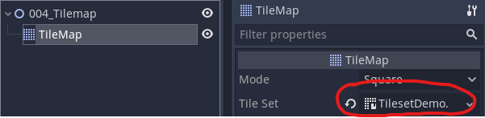

# Godot Mechanics Lab

[](https://godotengine.org/)

## Description

This project contains a series of experiments, scripts and studies I've made in Godot through all this years.

Every demo scene implements an unique and isolated mechanic you can use as example or as base for your studies in this amazing engine.

Enjoy! 👾

## Demo scenes

### 001 - Parallax Background

- No scripts required, you can made parallax effects in Godot only using the `ParallaxBackground` and `ParallaxLayer` nodes



### 002 - Look at Mouse Position

- It's simple to make a Node always "look" at the mouse position, just use the `look_at()` function

```gd
func _process(delta):
	look_at(get_global_mouse_position())
```



### 003 - Create Tilesets

- To create a tileset, create your Nodes in a separate scene, and convert the whole scene in menu `Scene -> Convert To -> TileSet`



### 004 - Using Tilesets

- To use a tilemap to create your levels, add a Tilemap Node in your scene, and load the tileset created in last step




## Assets:

- [Kenney](https://www.kenney.nl/assets/simplified-platformer-pack)
- [The Spriters Resource](https://www.spriters-resource.com/)
- [Sound Bible](http://soundbible.com/)
