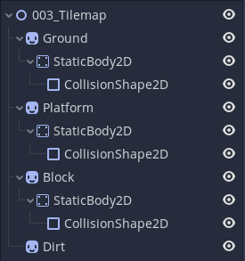
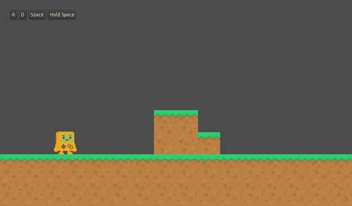
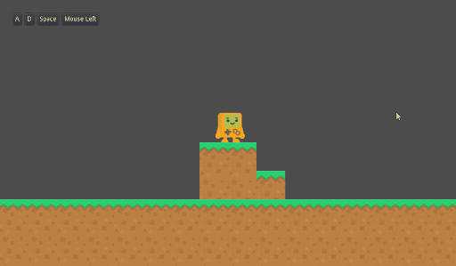
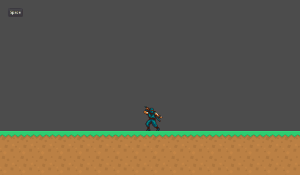
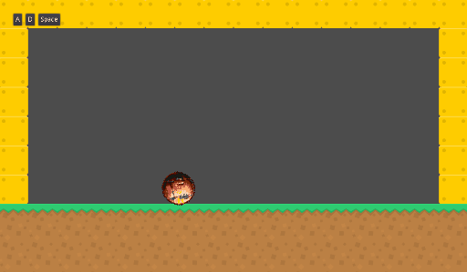

# Godot Mechanics Lab

[](https://godotengine.org/)

v3.3.2

# Description

This project contains a series of experiments, scripts and studies I've made in Godot through all this years.

Every [DemoScene](https://github.com/renanstn/godot-mechanics/tree/master/Mechanics%20Lab/DemoScenes) implements one mechanic I've created, or a mechanic existing in another game that I tried to replicate.

I hope you can use my scripts as an example or as a base for your studies in this amazing engine 😃

Enjoy! 👾

# Demo scenes

## 001 - Parallax Background

- No scripts required, you can make parallax effects in Godot only using the `ParallaxBackground` and `ParallaxLayer` nodes


## 002 - Look at Mouse Position

- It's simple to make a Node always "look" at the mouse position, just use the `look_at()` function

```gd
func _process(delta):
	look_at(get_global_mouse_position())
```


## 003 - Create Tilesets

- To create a tileset, create your Nodes in a separate scene, and convert the whole scene in menu `Scene -> Convert To -> TileSet`




## 004 - Using Tilesets

- To use a tilemap to create your levels, add a `Tilemap` Node in your scene, and load the tileset created in last step


## 005 - Basic Player

- This is the most simple and basic 2D platform player you can have. He can walk, he can jump, and have Idle, walking, and jumping animations. You can check the code [here](https://github.com/renanstn/godot-mechanics/blob/master/Mechanics%20Lab/Scripts/SimplePlayer.gd)


## 006 - Slow Motion Effect

- In this example, I tried to simulate a slow motion effect, just changing gradativally the `time_scale` value of the engine. You can check the code [here](https://github.com/renanstn/godot-mechanics/blob/master/Mechanics%20Lab/Scripts/SlowMotionEffect.gd)


## 007 - Arcade Car 3D

- This example implements a 3D arcade race car mechanic. This technique uses a sphere to run all the physics, and visually replace the sphere for the car 3D model
- This technique I've learned from [this](https://kidscancode.org/godot_recipes/3d/3d_sphere_car/) amazing tutorial


## 008 - Advanced Player

- In this new character script, gravity is not a fixed value randomly chosen by you. Instead, you set the blocks `UNIT_SIZE` of your tilemap, and all values will be calculated according to your blocks
- This way, it's easier to control how high (in blocks) and how much distance (in blocks) your character can reach in a jump
- Holding the "jump" button will make your character jump higher
- This player also had a `Tween` node to make some cool animations when you're jumping and when you're landing. You can configure how much the character will "deform" changing the "squash" value.
- And [here's the code](https://github.com/renanstn/godot-mechanics/blob/master/Mechanics%20Lab/Scripts/AdvancedPlayer.gd)



## 009 - Boomerang

- A simple and smooth boomerang
- Go towards mouse click coordinates
- Always return to the player
- [Code here](https://github.com/renanstn/godot-mechanics/blob/master/Mechanics%20Lab/Scripts/Boomerang.gd)

**Tips and tricks**

- To get the direction (`Vector2`) between 2 positions (`Vector2`)

```gd
var direction = (target - start_position).normalized()
```

- To move your object towards this direction

```gd
position += direction.rotated(rotation) * speed * delta
```

- To calc the distance between 2 positions

```gd
var distance_to_target = position.distance_to(target)
```



## 010 - The Messenger Jump

- In this demo, I tried to reproduce the "3 steps jump animation" used in [The Messenger](https://themessengergame.com/)
- This jump uses 3 animations, one when the character is upping, one when he's on top, and another when he's falling.
- I made this script to obtain this result

```gd

func animate():
    if !is_on_floor():
        if abs(motion.y) > JUMP / 2:
            if motion.y < 0:
                animator.play("Jump_up")
            else:
                animator.play("Jump_down")
        else:
            animator.play("Jump_roll")
```



## 011 - Rolling Ball

- With [this simple script]() you can control a rolling ball through a 2D scenario
- You can roll to the left, right, and you can jump



# Assets:

- [Kenney](https://www.kenney.nl/assets/simplified-platformer-pack)
- [The Spriters Resource](https://www.spriters-resource.com/)
- [Sound Bible](http://soundbible.com/)
